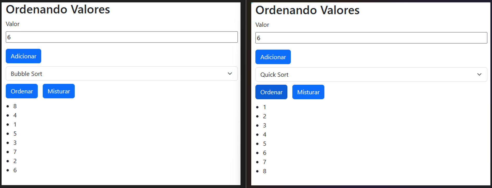

# Faculdade Estácio
## Curso Desenvolvimento Full Stack
## Mundo 2 - Nível 2
## Pedro Wilson Araújo Avilar

### Site Ordenando
Implementado com HTML, JavaScript e o framework Bootstrap. Recebe dados numéricos inseridos pelo usuário e armazena em uma lista, para assim, ordenar escolhendo entre três métodos disponíveis ou misturar os números da lista de forma aleatória, ficando a escolha do usuário.

### Site Receitas
Implementado com HTML, JavaScript, framework Bootstrap e JSON. Recebe os dados das receitas de um vetor de elementos JSON, que através do JavaScript é incorporado ao HTML.

### Site Usuários
Implementado com HTML, framework Bootstrap e Vue JS. Uso da Fetch API para requisição ao reqres.in para os dados dos usuários, usando o Vue JS para tratar os dados e incorporar no HTML.
